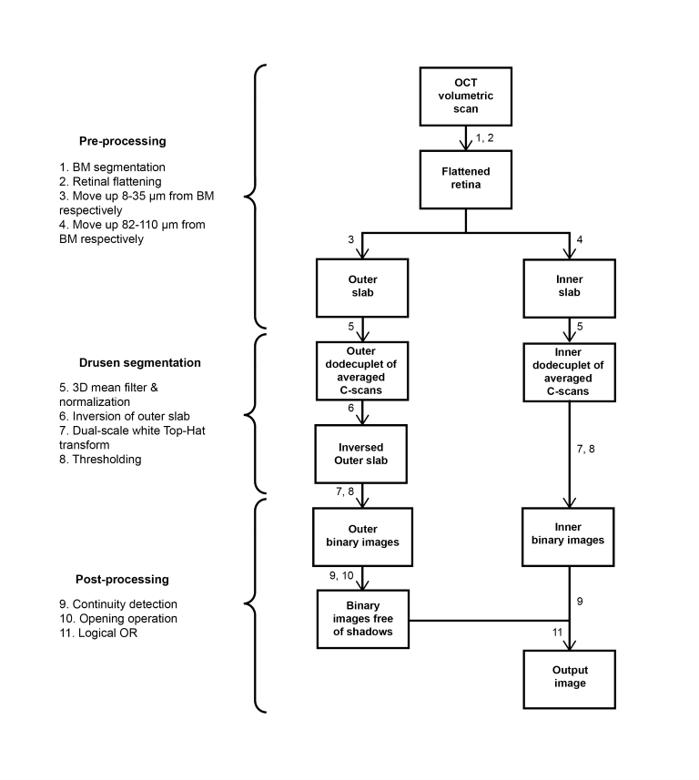
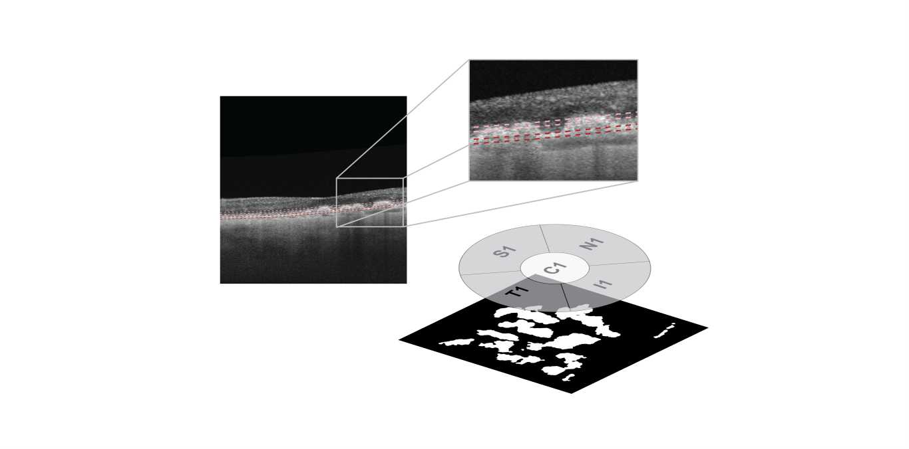

# drusenM2
The 'drusenM2' algorithm uses Bruch’s membrane (BM) segmentation data towards drusen detection. Area values corresponding to ETDRS subfieds are provided in table format.<br/> 
The algorithm is designed to be executed following the execution of 'segPLEX' (https://github.com/cnzakimuena/segPLEX).  Previously processed folders from 'segPLEX' (e.g. for ‘SamplePatient_01’, ‘SamplePatient_02’, etc.) each containing a 'Results' subfolder should be inserted into a 'processed' folder.  The 'processed' folder should be located inside the current directory (sample input dataset: https://www.kaggle.com/cnzakimuena/retinal-oct-and-octa-data-3).<br/> 



The en face method applied to images obtained using a different device is described in:

R. Zhao et al., "Automated drusen detection in dry age-related macular degeneration by multiple-depth, en face optical coherence tomography," Biomedical optics express, vol. 8, no. 11, pp. 5049-5064, 2017.

usage:

```matlab
call_drusenM2()
```

Cite As

Bélanger Nzakimuena, C. (2020). Automated Analysis of Retinal and Choroidal OCT and OCTA Images in AMD (Masters thesis, Polytechnique Montréal). Retrieved from https://publications.polymtl.ca/5234/


